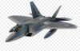

Raptor: a lattice based (linkable) ring signature
===========
Raptor signature and Reference Code

Contacts:

* Zhenfei Zhang

Contacts may be reached by sending mail to lastnamefirstname at gmail

Project Overview
================

Raptor (F-22) gets its name from its main building block: [Falcon](https://falcon-sign.info/) signature.
It is the next generation of Falcon (F-16) featured with a stealth mode.

The Raptor cryptography system consists of two component:

* lattice-based ring signature;
* lattice-based one time linkable ring signature.

Status of this code
-----
* Prototype
* non-audited (__use at your own risk!!!__)
* may use the following improvements:
  * signature size compression
  * more efficient discrete Gaussian sampler
  * replace Karatsuba with NTT
  * supporting Falcon-1024
  * removing redundancy
  * strip out NIST wrapper
  * unify the PRNG, XOF, hash, etc

FAQ
===
What is Raptor?
-------------
Raptor is an efficient instantiation of lattice based linkable ring signature.
The paper describing this signature scheme can be found:

  [__Raptor: A Practical Lattice-Based (Linkable) Ring Signature__](https://eprint.iacr.org/2018/857)
  _Xingye Lu_, _Man Ho Au_ and _Zhenfei Zhang_,
  ACNS 2019.

How efficient is Raptor?
-----------------
Raptor is the only implementable lattice based ring signature to date.
The current characteristics are

| Users       |     5    |  10 | 50 |
| ------------- |:-------------:| -----:| -----:|
| KeyGen       | 57 ms | 57 ms |57 ms|
| Sign      | 10.7 ms      |  17.4 ms | 61 ms|
| verification| 5.2 ms     |   11 ms | 50 ms |

It will be more efficient once I finish the todo list.
The estimated signing time will be of the same level as ECC based solutions, i.e., ~ 1 ms per signature.
The size will be

| Users       |     5    |  10 | 50 |
| ------------- |:-------------:| -----:| -----:|
| PK      | 0.9 KB|0.9 KB |0.9 KB|
| SK     |9.1 KB     |  9.1 KB | 9.1 KB|
| Signature|8.8 KB     |  16 KB | 73.8 KB |

Is Raptor Patented?
-----------------
This source code is released under GPL.
The Raptor algorithms are covered, to the best of my knowledge, by the following patents:

* NTRUSIGN (expiring 2021(?))
* ~~NTRU/Falcon based chameleon hash plus scheme; TBA~~
* ~~A new generic framework for ring signature; TBA~~
* ~~Raptor - instantiation of the framework with NTRU/Falcon~~

~The patents will still be enforced but may be used under the GPL,~
~i.e. under the condition that any work that uses them is also made available under the GPL.~
~The patents and the code implementations are also available under standard commercial terms.~

<!---

--->
